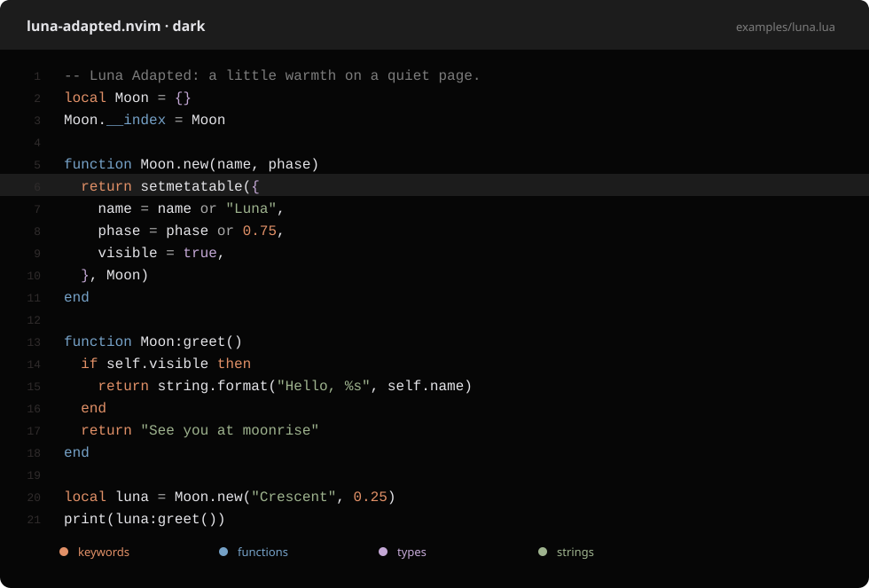
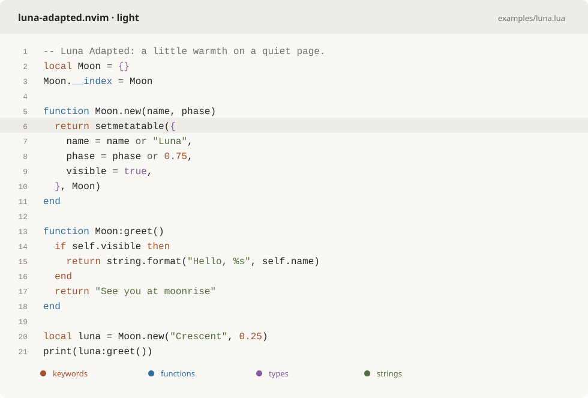

# luna-adapted.nvim

[Luna](https://github.com/WTFox/luna.nvim) for Neovim, with **dark and light
variants in one colorscheme**. The dark variant preserves Luna's original
near-black palette and highlights. The light variant adapts its orange, blue,
violet and sage accents to warm ivory surfaces with deeper, readable ink.

## Install with LazyVim

Requires **Neovim 0.10+** and a terminal with true-color support. No plugin
dependencies are required.

Add the following to `~/.config/nvim/lua/plugins/theme.lua`:

```lua
vim.o.background = "dark" -- use "light" for the light variant

return {
  {
    "fng0010/luna-adapted.nvim",
    main = "luna-adapted",
    lazy = false,
    priority = 1000,
    opts = {},
  },
  {
    "LazyVim/LazyVim",
    opts = { colorscheme = "luna-adapted" },
  },
}
```

Restart Neovim to let lazy.nvim install the theme. `main` tells lazy.nvim which
module to use for `setup()`, and the LazyVim specification selects the colorscheme.
Change `vim.o.background` in this file to choose the initial variant; subsequent
background changes automatically update the active theme.

## Preview

### Dark



### Light



_Previews generated from Neovim's Lua syntax highlights with the default
palettes._

## Choosing the variant

Load **one colorscheme**: `luna-adapted`. It follows Neovim's `background`
option and enables `termguicolors` automatically:

| Neovim setting     | Variant               |
| ------------------ | --------------------- |
| `background=dark`  | Original dark Luna    |
| `background=light` | Warm ivory light Luna |

Set an initial preference before loading the theme:

```lua
vim.o.background = "dark" -- or "light"
vim.cmd.colorscheme("luna-adapted")
```

Once loaded, changing only `background` updates the editor, syntax, plugin
highlights and terminal ANSI colors automatically. No second colorscheme or
plugin is needed:

```vim
:set background=light
:set background=dark
```

For automatic appearance changes, let your terminal or Neovim appearance
integration update `background`; Luna Adapted follows that option. The active
colorscheme name remains `luna-adapted` in both variants.

## Options

```lua
require("luna-adapted").setup({
  transparent = false,
  accent = 1.0, -- 0–1: blend syntax accents toward neutral ink
  plugins = {
    all = true, -- enable every integration without loading the plugins
    auto = true, -- detect lazy.nvim plugins when all = false
    -- telescope = false,
    -- ["neo-tree.nvim"] = false,
  },
  on_colors = function(colors)
    -- if vim.o.background == "light" then
    --   colors.bg = "#ffffff"
    -- end
  end,
  on_highlights = function(highlights, colors)
    -- highlights.Comment = { fg = colors.comment, italic = true }
  end,
})
vim.cmd.colorscheme("luna-adapted")
```

## Palette

| Role                 | Dark      | Light     |
| -------------------- | --------- | --------- |
| Background           | `#060606` | `#faf8f4` |
| Text                 | `#e4e4e8` | `#26262b` |
| Keywords / numbers   | `#e19067` | `#a4512b` |
| Functions            | `#75a1c7` | `#2f6b9e` |
| Types / constants    | `#c4a8d6` | `#8559a0` |
| Strings              | `#9eb38e` | `#526d3d` |
| Search / git changes | `#c2916a` | `#9c5f2a` |
| Visual selection     | `#404040` | `#b9cde6` |

## Integrations

Includes built-in syntax, Tree-sitter, LSP semantic tokens, diagnostics, diffs,
terminal colors and optional groups for:

- Avante, Blink, CopilotChat, Dashboard, Dressing and Diffview
- Flash, FzfLua, GitSigns, Grapple, Incline, Lazy and Leap
- Mini.statusline, Neo-tree, Render Markdown, Snacks and Telescope
- Tree-sitter Context, Trouble and Which-key

For lualine, load the colorscheme first and use the single named theme:

```lua
require("lualine").setup({
  options = { theme = "luna-adapted" },
})
```

The named lualine theme follows variant changes and preserves your configured
sections. If you change Luna Adapted options, reload the colorscheme to apply
them to lualine as well.

Query extensions in `after/queries/` cover JavaScript, TypeScript, TSX, Bash,
TOML and shell injection into JSON `scripts` values. Install the corresponding
Tree-sitter parsers to use them. Queries take effect while the plugin is on the
runtime path, including when another colorscheme is active.

## Ghostty

Companion terminal themes are included in [`extras/ghostty/`](extras/ghostty):

- `luna-adapted-dark`
- `luna-adapted-light`

Copy them into Ghostty's user themes directory and select the desired theme in
its configuration. Each Neovim variant matches its companion's sixteen ANSI
colors. The light variant retains Luna's original pastel bright ANSI slots,
which have less contrast on ivory than the deeper editor syntax colors.

## Development

Run from the repository root:

```sh
nvim --headless -u NONE -i NONE -l tests/theme.lua
python3 scripts/render_preview.py
```

Tests verify both variants, automatic background changes, lualine refresh,
contrast, terminal palettes, hooks, plugin selection and repeated reloads. With
the original `luna.nvim` checkout as a sibling, they also compare all dark
highlight definitions against the original. GitHub Actions tests Neovim 0.10.4
and the stable release.

See [CONTRIBUTING.md](CONTRIBUTING.md) for development guidance.

## Credits and license

Derived from [WTFox/luna.nvim](https://github.com/WTFox/luna.nvim) by A. Fox,
using source revision `727c19334528e1b8939f518d1ea43c4e62d98f91`. The original
dark design is preserved, with a light adaptation added in this repository.

This theme was made with GPT-6.1 Sol.

[MIT license](LICENSE). The original copyright notice is preserved.
